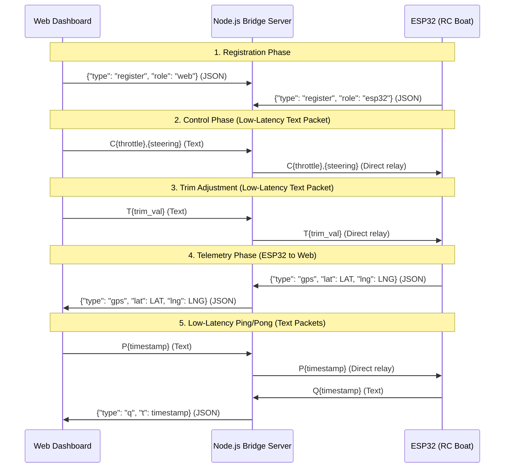

# Agent Instructions & Guidelines - Boat GPS Server

This file provides context, rules, and guidelines for AI coding agents working on the **Boat GPS Server** project.

## Tech Stack
- **Backend**: Node.js (Express, `ws` for WebSockets)
- **Frontend**: Vanilla HTML5, CSS3, JavaScript (Leaflet.js for GPS mapping)
- **Hardware/Firmware**: ESP32 microcontroller programmed in Arduino C++ (TinyGPSPlus, WebSocketsClient, ArduinoJson, ESP32Servo)

## Directory Structure
- [server.js](file:///home/trai/stacks/boat-v3/server.js): Main Node.js server file managing static files and WebSocket routing/bridging.
- [public/](file:///home/trai/stacks/boat-v3/public): Web client application.
  - [index.html](file:///home/trai/stacks/boat-v3/public/index.html): Control dashboard UI layout.
  - [style.css](file:///home/trai/stacks/boat-v3/public/style.css): Dashboard CSS styles.
  - [app.js](file:///home/trai/stacks/boat-v3/public/app.js): WebSocket connection, gamepad logic, Leaflet map configuration, telemetry calculations.
- [arduino/esp/esp.ino](file:///home/trai/stacks/boat-v3/arduino/esp/esp.ino): ESP32 firmware code.
- [.env.example](file:///home/trai/stacks/boat-v3/.env.example): Environment variable configuration template.
- [.dockerignore](file:///home/trai/stacks/boat-v3/.dockerignore) / [Dockerfile](file:///home/trai/stacks/boat-v3/Dockerfile) / [docker-compose.yml](file:///home/trai/stacks/boat-v3/docker-compose.yml): Deployment configuration.

## System Architecture & Communication Flow
The server acts as a low-latency WebSocket bridge between the web dashboard and the ESP32, bypassing JSON parsing overhead for control and latency loops.

## Hardware & Pin Assignments (ESP32)
- **ESC Signal**: Pin `13` (connected to ESC signal line)
- **Steering Servo**: Pin `12` (connected to rudder servo signal line)
- **GPS UART Connection (NEO-6M)**:
  - RX Pin: `16` (connected to NEO-6M TX)
  - TX Pin: `17` (connected to NEO-6M RX)
  - GPS Serial speed: `9600` baud (configured on HardwareSerial `2`)

## Protocol Specifications
1. **Registration (JSON)**:
   - Registry message: `{"type": "register", "role": "esp32" | "web"}`
2. **Control Packet (Low-Latency Text)**:
   - Dashboard sends `C<throttle_us>,<steering_us>` (e.g. `C1500,1500`).
   - Server relays it directly to the ESP32.
   - If JSON fallback `{"type": "control", "throttle": T, "steering": S}` is received, the server translates it to text packet `C<T>,<S>`.
3. **Steering Trim Packet (Low-Latency Text)**:
   - Dashboard sends `T<trim_us>` (e.g. `T-20` or `T+15`).
   - Server relays it directly to the ESP32.
   - If JSON fallback `{"type": "trim", "trim": V}` is received, the server translates it to `T<V>`.
4. **GPS Telemetry (JSON)**:
   - ESP32 publishes coordinates: `{"type": "gps", "lat": double, "lng": double}`.
   - Server relays it directly to the dashboard.
5. **Ping/Pong (Low-Latency Text)**:
   - Dashboard sends ping: `P<timestamp>` (e.g., `P178129039012`).
   - ESP32 responds with pong: `Q<timestamp>` (e.g., `Q178129039012`).
   - Server translates the pong to JSON for the web client: `{"type": "q", "t": timestamp}`.
   - Dashboard calculates latency: `Date.now() - timestamp`.

## Important Rules & Constraints
- **Safety First (Connection Lost)**: If WebSocket connection is lost (`WStype_DISCONNECTED`), the ESP32 must immediately stop the ESC/motor by writing `1000` microseconds.
- **Safety First (Control Timeout)**: If no control packet is received within `CONTROL_TIMEOUT_MS = 600` ms, the ESP32 must automatically trigger the motor cut-off failsafe and center the rudder.
- **ESC Arming Protocol**: In `setup()`, write Neutral Low (`1000` microseconds) to ESC and wait 4 seconds before starting WiFi/network connections.
- **WebSocket NoDelay & Compression**: The server disables Nagle's algorithm (`ws._socket.setNoDelay(true)`) and disables WebSocket compression (`perMessageDeflate: false`) to minimize latency.
- **Adaptive Step & Smoothing**: The ESP32 updates servos inside `updateServos()` at 10ms intervals. It uses adaptive stepping `constrain(delta / 3, minStep, maxStep)` to smoothly interpolate movements and avoid servo jerks.
- **Congestion Control**: The server and dashboard track `ws.bufferedAmount` to discard control packets if the buffer exceeds `128` bytes, preventing latency accumulation.
- **Server Failover (Primary/Backup)**: The ESP32 switches between primary host (`171.242.239.103:3000`) and backup host (`play.mairapvipproforsure.id.vn:25569`) if connection drops 3 consecutive times (`connection_fail_count >= max_fail_threshold`). Active switching is flagged with `is_switching_server` to avoid false error counting.
- **Code Language**: Original comments are written in Vietnamese. Preserve the language context and style.

## Post-Feature Change Workflow (Mandatory)
Whenever a feature change or modification is successfully implemented, the agent **MUST** spin up two subagents using the `invoke_subagent` tool to finalize the task:

1. **Agent 1: Documentation Update**
   - **Role**: `Documentation Updater`
   - **Prompt**: "Review the recent codebase changes, identify any modified features, configurations, protocols, or pin assignments. Update all relevant markdown (`.md`) files in the workspace (such as [README.md](file:///home/trai/stacks/boat-v3/README.md), [ARCHITECTURE.md](file:///home/trai/stacks/boat-v3/ARCHITECTURE.md), [GEMINI.md](file:///home/trai/stacks/boat-v3/GEMINI.md), and [AGENTS.md](file:///home/trai/stacks/boat-v3/AGENTS.md)) to accurately reflect the changes. Ensure instructions, sequence diagrams, and architecture guides are fully aligned."
   
2. **Agent 2: Solid Commit Creator**
   - **Role**: `Git Committer`
   - **Prompt**: "Run git status and git diff to inspect the changes. Compose a high-quality, professional git commit message detailing what changes were made and why, following conventional commits standard. Stage all appropriate files and create a clean git commit."
