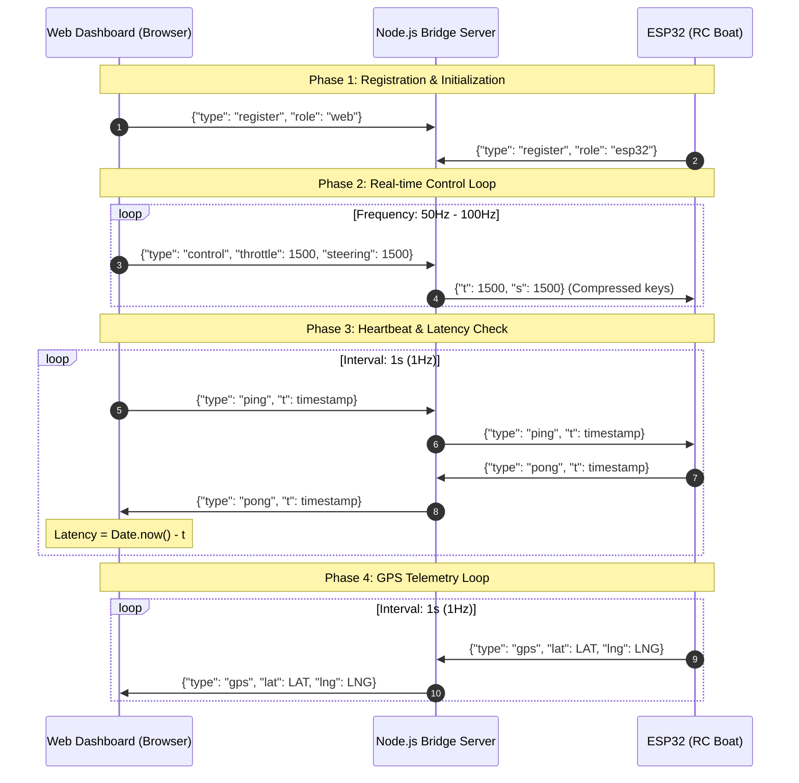

# System Architecture - Boat GPS Server

This document outlines the system architecture, design decisions, folder structure, communication protocols, and hardware wiring configuration for the **Boat GPS Server** project.

---

## 1. System Overview

The **Boat GPS Server** is an integrated hardware and software solution designed to control an RC (Radio Controlled) boat and monitor its real-time GPS coordinates. The system relies on a **Broker/Relay Pattern** using **WebSockets** to ensure low-latency communication.

### Core Design Principles:
- **Real-Time Control**: Low-latency, full-duplex bi-directional communication via WebSockets.
- **Safety Failsafe**: Automatic motor cut-off in case of signal loss to prevent runaway scenarios on the water.
- **Payload Optimization**: Compressed keys for messages sent to the microcontroller to save network bandwidth.

---

## 2. System Context & Diagrams

The system utilizes a Star Topology where the Node.js server acts as a central broker relaying messages between the Web Dashboard and the ESP32 client.



---

## 3. Project Directory Structure

The codebase is split cleanly into frontend client, backend relay server, and microcontroller firmware:

```text
boat-v3/
├── .agents/                    # AI Coding Agent configs
│   ├── AGENTS.md               # Project-scoped custom rules (English)
│   └── GEMINI.md               # Project-scoped Gemini custom rules (English)
├── arduino/
│   └── esp/
│       └── esp.ino             # ESP32 C++ (Arduino) source code
├── public/                     # Web Dashboard Assets (Web Client)
│   ├── app.js                  # WebSocket, Gamepad API, and Leaflet Map logic
│   ├── index.html              # FPV HUD UI Layout
│   └── style.css               # Styling
├── AGENTS.md                   # Global agent rules
├── ARCHITECTURE.md             # This file (System Architecture)
├── docker-compose.yml          # Container configuration
├── Dockerfile                  # Node.js Alpine Docker definition
├── GEMINI.md                   # Global Gemini rules
├── README.md                   # Quick start guide (Vietnamese)
├── package.json                # Server script & dependencies config
└── server.js                   # Node.js server entry point (WebSocket Bridge)
```

---

## 4. Key Components

### 4.1. Web Dashboard (Frontend)
- **Files**: [public/index.html](file:///home/trai/stacks/boat-v3/public/index.html), [public/app.js](file:///home/trai/stacks/boat-v3/public/app.js), [public/style.css](file:///home/trai/stacks/boat-v3/public/style.css)
- **Responsibilities**:
  - Read input controls from a connected gamepad (e.g., PS4 controller) using the **HTML5 Gamepad API**.
  - Render a satellite map (Google Hybrid) utilizing **Leaflet.js** and show the boat's live marker location.
  - Allow setting a `Home Point` and calculate real-time distance (Haversine formula) to the boat marker for emergency tracking.

### 4.2. Node.js Relay Server (Backend)
- **Files**: [server.js](file:///home/trai/stacks/boat-v3/server.js)
- **Responsibilities**:
  - Authenticate and manage connections by mapping socket state to roles (`web` or `esp32`).
  - Relay control commands down to the ESP32 and telemetry updates up to the web dashboard.
  - Perform key-compression to minimize JSON size over cellular/LAN interfaces.

### 4.3. ESP32 Firmware (Client)
- **Files**: [arduino/esp/esp.ino](file:///home/trai/stacks/boat-v3/arduino/esp/esp.ino)
- **Responsibilities**:
  - Read raw NMEA stream from the NEO-6M GPS module via Serial2 at `9600` baud.
  - Decode telemetry with the `TinyGPSPlus` library.
  - Apply PWM pulse signals to the Speed Controller (ESC) and Steering Servo using the `ESP32Servo` library.
  - Maintain the WebSocket connection, register itself, and publish telemetry packets.

---

## 5. Design & Tech Stack Decisions

### 5.1. WebSocket Giga-frequency Connection vs HTTP/REST
- **Decision**: WebSocket full-duplex TCP connections are used instead of HTTP polling/POST requests.
- **Rationale**: Gamepad events need to be transmitted at 50-100Hz. Using HTTP would introduce massive overhead from headers and socket handshake setups. WebSockets preserve the connection, bringing latency down to milliseconds.

### 5.2. JSON Key Compression
- **Decision**: Translate `{"type": "control", "throttle": 1500, "steering": 1500}` into `{"t": 1500, "s": 1500}` at the server level.
- **Rationale**: Keeps packets short for the ESP32 client, reducing buffer memory allocation issues and decreasing transmission time over low-bandwidth wireless/LTE connections.

### 5.3. Servo and ESC Microsecond Control Writes
- **Decision**: Write microsecond duration signals (`1000µs` - `2000µs`) to servos/ESC rather than write angles (`0` - `180`°).
- **Rationale**: Speed controllers (ESCs) and precision rudder servos respond directly to the pulse duration. Direct pulse width write offers much higher resolution tuning and calibration compared to degree mappings.

---

## 6. Failsafes & Security

### 6.1. Connection Loss Failsafe
- An RC boat on open water must stop if communication with the operator is lost.
- **Solution**: Inside the `webSocketEvent` loop on the ESP32, if a `WStype_DISCONNECTED` event occurs, the firmware immediately writes `1000` microseconds to the ESC pin (`13`) to cut off the motor.

### 6.2. ESC Arming Protocol
- Electronic Speed Controllers require a startup sequence to avoid immediate motor spins.
- **Solution**: In `setup()`, the ESP32 writes `1000` (neutral low throttle) to the ESC pin and blocks for 4 seconds using `delay(4000)`. Once the ESC plays a long beep (successful arming validation), the ESP32 proceeds to initialize WiFi and WebSocket connection tasks.

---

## 7. Deployment & Testing

- **Dockerized Environment**: The project provides a [Dockerfile](file:///home/trai/stacks/boat-v3/Dockerfile) running Node.js on Alpine Linux, managed by [docker-compose.yml](file:///home/trai/stacks/boat-v3/docker-compose.yml).
- **Local Testing**:
  1. Boot up the Node.js server.
  2. Visit `http://localhost:3000`.
  3. Hook up a gamepad controller and press triggers to verify PWM outputs mapped onto the console.
  4. Track ping latency dynamically.
