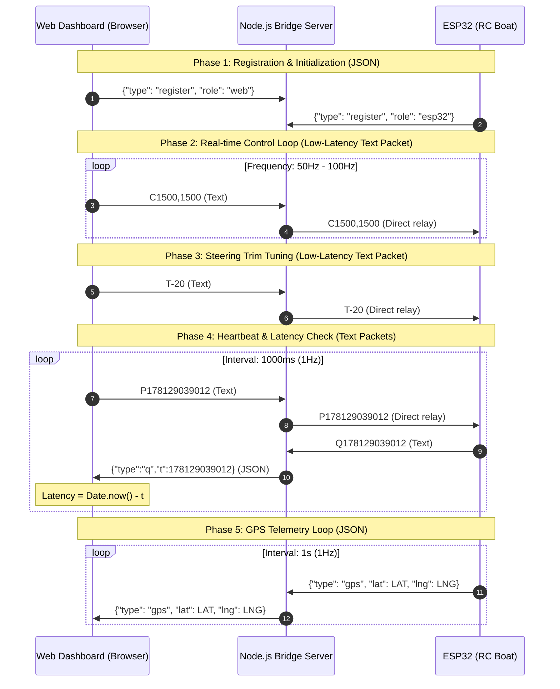

# System Architecture - Boat GPS Server

This document outlines the system architecture, design decisions, folder structure, communication protocols, and hardware wiring configuration for the **Boat GPS Server** project.

---

## 1. System Overview

The **Boat GPS Server** is an integrated hardware and software solution designed to control an RC (Radio Controlled) boat and monitor its real-time GPS coordinates. The system relies on a **Broker/Relay Pattern** using **WebSockets** to ensure low-latency communication.

### Core Design Principles:
- **Real-Time Control**: Low-latency, full-duplex bi-directional communication via WebSockets.
- **Safety Failsafe**: Automatic motor cut-off in case of signal loss to prevent runaway scenarios on the water.
- **Payload Optimization**: Compressed keys for messages sent to the microcontroller to save network bandwidth.

---

## 2. System Context & Diagrams

The system utilizes a Star Topology where the Node.js server acts as a central broker relaying messages between the Web Dashboard and the ESP32 client.



---

## 3. Project Directory Structure

The codebase is split cleanly into frontend client, backend relay server, and microcontroller firmware:

```text
boat-v3/
├── .cursor/rules/
│   └── boat-gps.mdc            # Cursor rules file (auto-generated)
├── .github/
│   └── copilot-instructions.md # GitHub Copilot instructions (auto-generated)
├── arduino/
│   └── esp/
│       └── esp.ino             # ESP32 C++ (Arduino) source code
├── public/                     # Web Dashboard Assets (Web Client)
│   ├── app.js                  # WebSocket, Gamepad API, and Leaflet Map logic
│   ├── index.html              # FPV HUD UI Layout
│   └── style.css               # Styling
├── scripts/
│   └── sync-rules.js           # AI Agent rules synchronization utility script
├── .cursorrules                # Cursor rules file (auto-generated)
├── .dockerignore               # Docker build ignore list
├── .env.example                # Sample environment configurations
├── AGENTS.md                   # Global agent rules master file
├── ARCHITECTURE.md             # This file (System Architecture)
├── CLAUDE.md                   # Claude assistant rules (auto-generated)
├── docker-compose.yml          # Container configuration
├── Dockerfile                  # Node.js Alpine Docker definition
├── GEMINI.md                   # Gemini assistant rules (auto-generated)
├── package.json                # Server script & dependencies config
└── server.js                   # Node.js server entry point (WebSocket Bridge)
```

---

## 4. Key Components

### 4.1. Web Dashboard (Frontend)
- **Files**: [public/index.html](file:///home/trai/stacks/boat-v3/public/index.html), [public/app.js](file:///home/trai/stacks/boat-v3/public/app.js), [public/style.css](file:///home/trai/stacks/boat-v3/public/style.css)
- **Responsibilities**:
  - Read input controls from a connected gamepad (e.g., PS4 controller) using the **HTML5 Gamepad API**.
  - Render a satellite map (Google Hybrid) utilizing **Leaflet.js** and show the boat's live marker location.
  - Allow setting a `Home Point` and calculate real-time distance (Haversine formula) to the boat marker for emergency tracking.

### 4.2. Node.js Relay Server (Backend)
- **Files**: [server.js](file:///home/trai/stacks/boat-v3/server.js)
- **Responsibilities**:
  - Load runtime environment configurations (e.g. `PORT`) dynamically using the `dotenv` package.
  - Authenticate and manage connections by mapping socket state to roles (`web` or `esp32`).
  - Relay low-latency control commands (`C`, `T`, `P`, `Q` text packets) directly between dashboard and ESP32.
  - Convert incoming JSON control commands to compact text packets before relaying to ESP32.
  - Suppress TCP Nagle's algorithm overhead via `ws._socket.setNoDelay(true)` and disable WebSocket compression (`perMessageDeflate: false`) to ensure sub-millisecond network bridging.
  - Implement congestion control by tracking `ws.bufferedAmount` and dropping older control packets if the queue exceeds 128 bytes.

### 4.3. ESP32 Firmware (Client)
- **Files**: [arduino/esp/esp.ino](file:///home/trai/stacks/boat-v3/arduino/esp/esp.ino)
- **Responsibilities**:
  - Read raw NMEA stream from the NEO-6M GPS module via Serial2 at `9600` baud.
  - Decode telemetry with the `TinyGPSPlus` library.
  - Maintain a fast, non-JSON text parser to process control (`C`), steering trim (`T`), and ping (`P`) commands without heap allocation or parsing delay.
  - Apply PWM pulse signals to the Speed Controller (ESC) and Steering Servo using the `ESP32Servo` library.
  - Implement an adaptive step update loop (`updateServos()`) running at 10ms intervals to smoothly interpolate both motor throttle and steering servo adjustments, avoiding mechanical jerks or sudden acceleration.
  - Manage connection state and perform automatic failover switching to the backup server if connection drops consecutively 3 times.

### 4.4. Hardware & Pin Assignments (ESP32)
- **ESC Signal**: Pin `13` (connected to ESC signal line)
- **Steering Servo**: Pin `12` (connected to rudder servo signal line)
- **GPS UART Connection (NEO-6M)**:
  - RX Pin: `16` (connected to NEO-6M TX)
  - TX Pin: `17` (connected to NEO-6M RX)
  - GPS Serial speed: `9600` baud (configured on HardwareSerial `2`)

---

## 5. Design & Tech Stack Decisions

### 5.1. WebSocket Giga-frequency Connection vs HTTP/REST
- **Decision**: WebSocket full-duplex TCP connections are used instead of HTTP polling/POST requests.
- **Rationale**: Gamepad events need to be transmitted at 50-100Hz. Using HTTP would introduce massive overhead from headers and socket handshake setups. WebSockets preserve the connection, bringing latency down to milliseconds.

### 5.2. Custom Compact Text Packet Protocol vs JSON
- **Decision**: Send raw ASCII-delimited packets (`C<throttle_us>,<steering_us>`, `T<trim_us>`, `P<timestamp>`) for real-time control and heartbeats.
- **Rationale**: Eliminates JSON serialization/deserialization CPU overhead and minimizes payload sizes over wireless or mobile networks, reducing TCP transmission delays and improving responsiveness.

### 5.3. Servo and ESC Microsecond Control Writes
- **Decision**: Write microsecond duration signals (`1000µs` - `2000µs`) to servos/ESC rather than write angles (`0` - `180`°).
- **Rationale**: Speed controllers (ESCs) and precision rudder servos respond directly to the pulse duration. Direct pulse width write offers much higher resolution tuning and calibration compared to degree mappings.

---

## 6. Failsafes & Security

### 6.1. Connection Loss Failsafe
- An RC boat on open water must stop if communication with the operator is lost.
- **Solution**: Inside the `webSocketEvent` loop on the ESP32, if a `WStype_DISCONNECTED` event occurs, the firmware immediately writes `1000` microseconds to the ESC pin (`13`) to cut off the motor.

### 6.2. Control Packet Timeout Failsafe
- Prevents runaway scenarios if the connection remains active but the operator client dashboard crashes or stops transmitting command streams.
- **Solution**: The ESP32 tracks the duration since the last valid control packet (`lastControlPacketMs`). If the duration exceeds `CONTROL_TIMEOUT_MS = 600` ms, the firmware automatically sets the motor throttle target to safe (`1000` us) and centers the steering rudder target (`1500` us).

### 6.3. ESC Arming Protocol
- Electronic Speed Controllers require a startup sequence to avoid immediate motor spins.
- **Solution**: In `setup()`, the ESP32 writes `1000` (neutral low throttle) to the ESC pin and blocks for 4 seconds using `delay(4000)`. Once the ESC plays a long beep (successful arming validation), the ESP32 proceeds to initialize WiFi and WebSocket connection tasks.

### 6.4. WebSocket Server Failover (Auto-switching)
- If the primary local server goes offline (e.g. laptop shut down, local network issue), the boat must switch to a backup server over the internet to restore control capability.
- **Solution**: The ESP32 tracks the number of consecutive connection failures (`connection_fail_count`) up to `max_fail_threshold = 3`. 
  - Upon reaching the limit, it toggles `using_backup`, flag-schedules a reconnect using `should_switch_server`, and triggers `connectToWebSocket()`.
  - When actively initiating a switch, it flags `is_switching_server = true` to temporarily bypass the error-counting block on disconnect, preventing infinite switching loops.
  - A successful connection (`WStype_CONNECTED`) immediately resets `connection_fail_count` to `0`.

---

## 7. Deployment & Testing

- **Dockerized Environment**: The project provides a [Dockerfile](file:///home/trai/stacks/boat-v3/Dockerfile) running Node.js on Alpine Linux, managed by [docker-compose.yml](file:///home/trai/stacks/boat-v3/docker-compose.yml).
- **Local Testing**:
  1. Boot up the Node.js server.
  2. Visit `http://localhost:3000`.
  3. Hook up a gamepad controller and press triggers to verify PWM outputs mapped onto the console.
  4. Track ping latency dynamically.

---

## 8. Developer & AI Agent Guidelines

### AI Agent Rules Synchronization
The project uses a master rule file, [AGENTS.md](file:///home/trai/stacks/boat-v3/AGENTS.md), to define code patterns, pin mappings, and failsafe constraints. 

Whenever changes are made to these guidelines, run the rule synchronization script:
```bash
npm run sync-rules
```
This utility automatically updates `GEMINI.md`, `CLAUDE.md`, `.cursorrules`, `.cursor/rules/boat-gps.mdc`, and `.github/copilot-instructions.md` to ensure all AI tools stay perfectly in sync with the codebase specifications.
