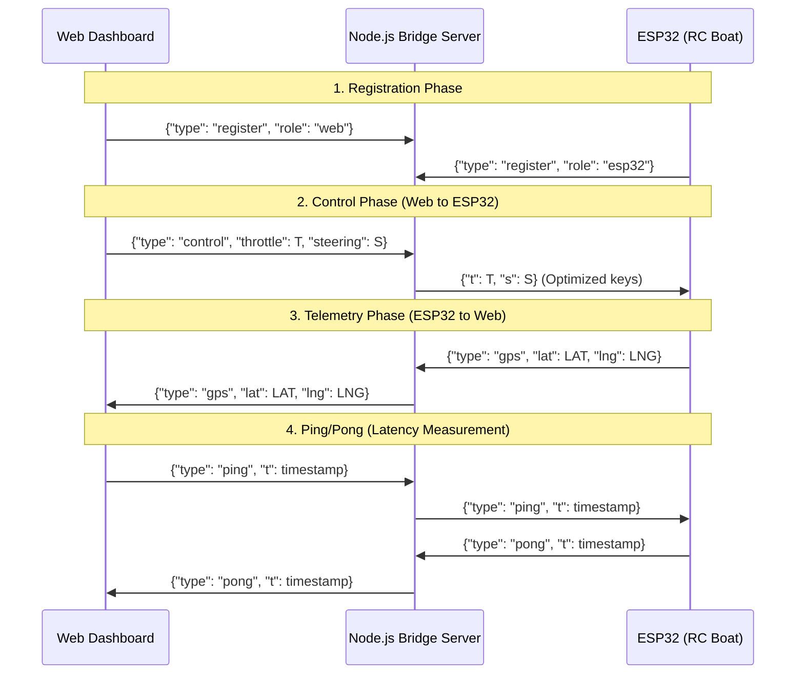

# Gemini Assistant Instructions & Guidelines - Boat GPS Server

This file provides context, rules, and guidelines for the Gemini assistant and other AI coding agents working on the **Boat GPS Server** project.

## Tech Stack
- **Backend**: Node.js (Express, `ws` for WebSockets)
- **Frontend**: Vanilla HTML5, CSS3, JavaScript (Leaflet.js for GPS mapping)
- **Hardware/Firmware**: ESP32 microcontroller programmed in Arduino C++ (TinyGPSPlus, WebSocketsClient, ArduinoJson, ESP32Servo)

## Directory Structure
- [server.js](file:///home/trai/stacks/boat-v3/server.js): Main Node.js server file managing static files and WebSocket routing/bridging.
- [public/](file:///home/trai/stacks/boat-v3/public): Web client application.
  - [index.html](file:///home/trai/stacks/boat-v3/public/index.html): Control dashboard UI layout.
  - [style.css](file:///home/trai/stacks/boat-v3/public/style.css): Dashboard CSS styles.
  - [app.js](file:///home/trai/stacks/boat-v3/public/app.js): WebSocket connection, gamepad logic, Leaflet map configuration, telemetry calculations.
- [arduino/esp/esp.ino](file:///home/trai/stacks/boat-v3/arduino/esp/esp.ino): ESP32 firmware code.
- [Dockerfile](file:///home/trai/stacks/boat-v3/Dockerfile) / [docker-compose.yml](file:///home/trai/stacks/boat-v3/docker-compose.yml): Deployment configuration.

## System Architecture & Communication Flow
The server acts as a low-latency WebSocket bridge between the web dashboard and the ESP32.

## Hardware & Pin Assignments (ESP32)
- **ESC Signal**: Pin `13` (connected to ESC signal line)
- **Steering Servo**: Pin `12` (connected to rudder servo signal line)
- **GPS UART Connection (NEO-6M)**:
  - RX Pin: `16` (connected to NEO-6M TX)
  - TX Pin: `17` (connected to NEO-6M RX)
  - GPS Serial speed: `9600` baud (configured on HardwareSerial `2`)

## Protocol Specifications
1. **Registry Message**:
   - `{"type": "register", "role": "esp32" | "web"}`
2. **Control Message (Web Client to Server)**:
   - `{"type": "control", "throttle": number, "steering": number}`
3. **Bridge Translation (Server to ESP32)**:
   - Server translates `throttle` -> `t` and `steering` -> `s` to save network bandwidth:
     `{"t": throttle_value, "s": steering_value}`
4. **GPS Telemetry (ESP32 to Server to Web)**:
   - `{"type": "gps", "lat": double, "lng": double}`
5. **Ping/Pong (Web to Server to ESP32 & Back)**:
   - Ping: `{"type": "ping", "t": timestamp}`
   - Pong: `{"type": "pong", "t": timestamp}`
   - Web application calculates connection latency by measuring: `Date.now() - t`.

## Important Rules & Constraints
- **Safety First**: If WebSocket connection to the server is lost (`WStype_DISCONNECTED`), the ESP32 must immediately stop the ESC/motor by writing `1000` microseconds.
- **ESC Arming Protocol**: In `setup()`, the ESC must be armed before enabling WiFi or performing network operations. Write Neutral/Neutral Low (`1000` microseconds) to ESC and wait 4 seconds.
- **Server Failover (Primary/Backup)**: The ESP32 implements auto-failover switching between a primary host (`192.168.1.184:3000`) and a backup host (`play.mairapvipproforsure.id.vn:25569`). If connection drops 3 consecutive times (`connection_fail_count >= max_fail_threshold`), toggle the host and reconnect via `connectToWebSocket()`. Active switching is flagged with `is_switching_server` to avoid false error counting.
- **Payload Optimization**: Keep JSON messages between ESP32 and Server minimal. Use compressed keys (like `t` and `s`) where necessary.
- **Leaflet & Mapping**: Zoom controls are disabled on the Leaflet map to provide a clean FPV HUD layout. Always handle cases where GPS signals are not yet locked or home points are not set.
- **Code Language**: Original comments are written in Vietnamese. Preserve the language context and style.
