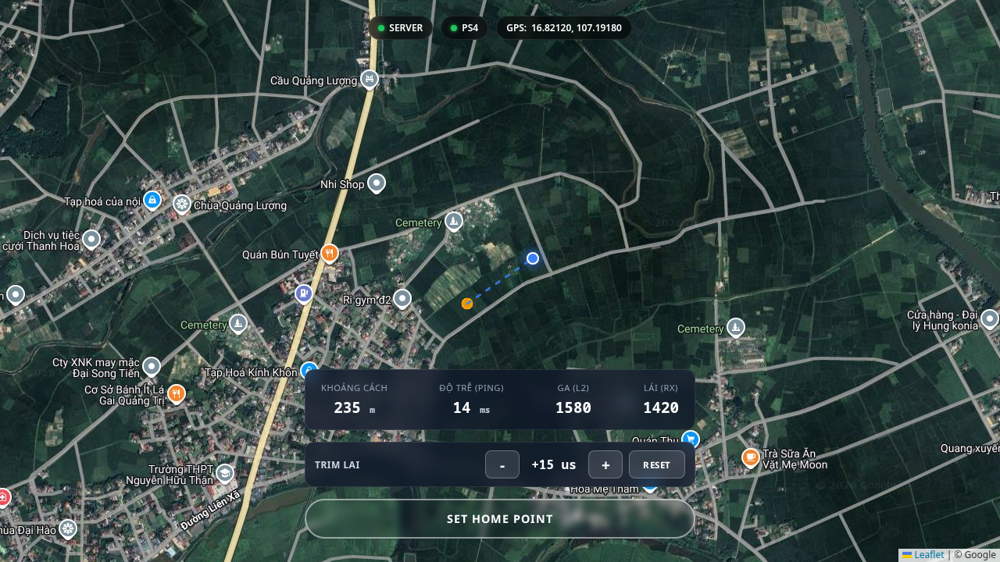
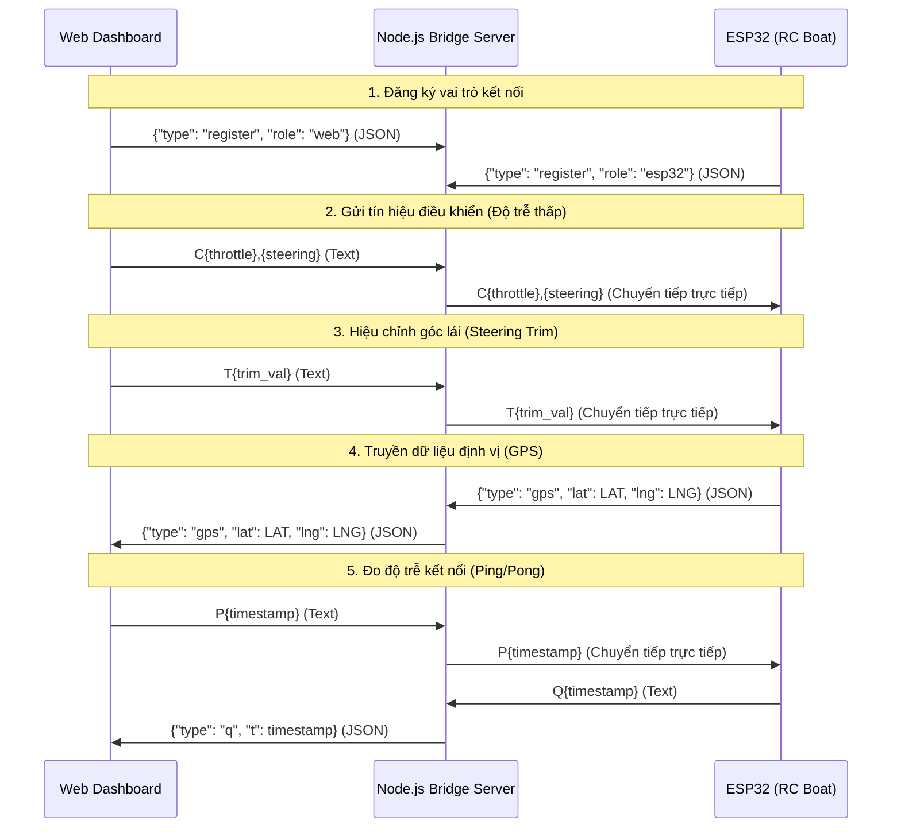

# 🚤 Boat GPS Server

Server Node.js hiệu năng cao, độ trễ cực thấp phục vụ điều khiển thuyền RC và giám sát vị trí GPS thời gian thực. Hệ thống tích hợp giao diện web giám sát bản đồ (Leaflet.js) và bộ điều khiển tay cầm PS4 thông qua cầu nối WebSocket trực tiếp đến vi điều khiển ESP32.

[](https://nodejs.org/)
[](https://www.espressif.com/)
[](https://leafletjs.com/)
[](https://websockets.spec.whatwg.org/)
[](https://opensource.org/licenses/MIT)

---

<p align="center">
  
</p>

---

## 📌 Mục lục

- [Chức năng chính](#-chức-năng-chính)
- [Cấu trúc thư mục](#-cấu-trúc-thư-mục)
- [Yêu cầu hệ thống](#-yêu-cầu-hệ-thống)
- [Cài đặt & Chạy Server](#-cài-đặt--chạy-server)
  - [Cấu hình môi trường](#cấu-hình-môi-trường)
  - [Chạy Server cục bộ](#chạy-server-cục-bộ)
  - [Chạy với Docker](#chạy-với-docker)
- [Cấu hình & Nạp Code ESP32](#-cấu-hình--nạp-code-esp32)
  - [Sơ đồ chân & Phân bổ phần cứng](#sơ-đồ-chân--phân-bổ-phần-cứng)
  - [Cơ chế nạp & Khởi động ESC](#cơ-chế-nạp--khởi-động-esc)
- [Luồng hoạt động & Giao thức WebSocket](#-luồng-hoạt-động--giao-thức-websocket)
  - [Luồng kết nối](#luồng-kết-nối)
  - [Quy chuẩn gói tin WebSocket](#quy-chuẩn-gói-tin-websocket)
- [Cơ chế an toàn & Failsafe](#-cơ-chế-an-toàn--failsafe)
- [Ghi chú khi chạy thực tế](#-ghi-chú-khi-chạy-thực-tế)
- [Giấy phép](#-giấy-phép)

---

## 🚀 Chức năng chính

- **Giao diện điều khiển hiện đại**: Dashboard thời gian thực hiển thị bản đồ Leaflet, tốc độ, góc lái và trạng thái kết nối.
- **Truyền dẫn độ trễ cực thấp**: Tối ưu hóa WebSockets bằng cách loại bỏ thuật toán Nagle (`setNoDelay(true)`) và tắt nén dữ liệu (`perMessageDeflate: false`).
- **Giao thức nén gọn**: Các lệnh điều khiển dạng text tối giản (`C<throttle>,<steering>`) giúp giảm thiểu băng thông và overhead phân tích JSON.
- **Tích hợp Gamepad API**: Điều khiển thuyền mượt mà bằng tay cầm PS4 (sử dụng trục Rx và cò L2).
- **Cơ chế Failover thông minh**: ESP32 tự động chuyển đổi giữa Server chính (Primary) và Server dự phòng (Backup) khi gặp sự cố mạng.
- **Container hóa với Docker**: Hỗ trợ triển khai nhanh chóng thông qua Docker và Docker Compose.

---

## 📁 Cấu trúc thư mục

```text
.
├── arduino/
│   └── esp/
│       └── esp.ino        # Mã nguồn C++ nạp cho vi điều khiển ESP32
├── assets/
│   └── boat_control_dashboard.png # Ảnh chụp thực tế giao diện ứng dụng
├── public/
│   ├── app.js             # Logic phía Web Client (Leaflet, Gamepad, WS)
│   ├── index.html         # Giao diện dashboard HTML5
│   └── style.css          # Định dạng và giao diện CSS3
├── .dockerignore
├── .env.example           # File cấu hình môi trường mẫu
├── docker-compose.yml     # File cấu hình Docker Compose
├── Dockerfile             # Cấu hình build Docker image cho server
├── package.json
├── package-lock.json
├── README.md
└── server.js              # Server Node.js chính (WebSocket bridge)
```

---

## 💻 Yêu cầu hệ thống

- **Software**: Node.js 18 trở lên & npm.
- **Hardware**: Vi điều khiển ESP32, bộ thu GPS NEO-6M, ESC (Electronic Speed Controller), động cơ Brushless, và servo bánh lái.
- **Mạng**: Máy chạy server và ESP32 cần ở chung mạng LAN, hoặc server phải có IP công cộng mà ESP32 có thể kết nối tới.

---

## 🛠️ Cài đặt & Chạy Server

### Cấu hình môi trường

Tạo file môi trường `.env` từ file mẫu:

```bash
cp .env.example .env
```

Nội dung mặc định trong `.env`:
```text
PORT=3000
```
*(Nếu không chỉ định, server sẽ mặc định lắng nghe trên cổng 3000)*

### Chạy Server cục bộ

1. Cài đặt các gói phụ thuộc:
   ```bash
   npm install
   ```

2. Khởi chạy server:
   ```bash
   npm start
   ```

Server sẽ chạy tại địa chỉ: `http://localhost:3000`

### Chạy với Docker

Nếu bạn muốn đóng gói và triển khai ứng dụng dưới dạng Container:

```bash
docker compose up --build
```

---

## 🔌 Cấu hình & Nạp Code ESP32

Mã nguồn điều khiển nằm tại [arduino/esp/esp.ino](file:///home/trai/stacks/boat-v3/arduino/esp/esp.ino).

### Sơ đồ chân & Phân bổ phần cứng

| Linh kiện | Chân trên ESP32 | Ghi chú |
| :--- | :--- | :--- |
| **ESC Signal (Động cơ)** | GPIO `13` | Tín hiệu PPM điều khiển tốc độ động cơ |
| **Steering Servo (Lái)** | GPIO `12` | Tín hiệu điều khiển góc nghiêng bánh lái |
| **ESP32 RX2 (GPS RX)** | GPIO `16` | Kết nối vào chân TX của module GPS NEO-6M |
| **ESP32 TX2 (GPS TX)** | GPIO `17` | Kết nối vào chân RX của module GPS NEO-6M |
| **Baudrate Serial GPS** | `9600` | Cấu hình trên HardwareSerial 2 |

### Cơ chế nạp & Khởi động ESC

> [!IMPORTANT]
> **Quy trình kích hoạt ESC an toàn (ESC Arming Protocol):**
> Trong hàm `setup()`, hệ thống sẽ ghi giá trị xung an toàn thấp nhất (`1000` microseconds) và chờ **4 giây** để ESC nhận tín hiệu và kích hoạt thành công (Arming) trước khi khởi tạo các kết nối Wi-Fi/WebSocket. Điều này giúp ngăn ngừa việc động cơ tự động quay đột ngột khi cấp nguồn.

Cấu hình Wi-Fi và danh sách máy chủ trong file code `esp.ino`:

```cpp
const char* ssid = "TEN_WIFI";
const char* password = "MAT_KHAU_WIFI";

// Danh sách máy chủ để tự động chuyển đổi khi mất kết nối
const char* primary_host = "HOST_SERVER_CHINH";
const int primary_port = PORT_SERVER_CHINH;

const char* backup_host = "HOST_SERVER_DU_PHONG";
const int backup_port = PORT_SERVER_DU_PHONG;
```

---

## 🔄 Luồng hoạt động & Giao thức WebSocket

### Luồng kết nối



### Quy chuẩn gói tin WebSocket

#### 1. Đăng ký thiết bị (Định dạng JSON)
- **Web UI Client**: `{"type": "register", "role": "web"}`
- **ESP32 Client**: `{"type": "register", "role": "esp32"}`

#### 2. Lệnh điều khiển thời gian thực (Định dạng Text)
- Cấu trúc: `C<throttle_us>,<steering_us>`
- *Ví dụ:* `C1500,1500` (Khoảng giá trị xung từ `1000` đến `2000` microseconds).

#### 3. Lệnh hiệu chỉnh bánh lái (Định dạng Text)
- Cấu trúc: `T<trim_us>`
- *Ví dụ:* `T-15` hoặc `T+20` (Bù góc lái lệch trong khoảng `-200` đến `200` microseconds).

#### 4. Dữ liệu định dạng GPS (Định dạng JSON)
- ESP32 gửi lên: `{"type": "gps", "lat": 16.82120, "lng": 107.19180}`
- Server chuyển tiếp về Web UI nguyên vẹn để hiển thị vị trí và vẽ đường đi trên bản đồ.

#### 5. Đo độ trễ mạng (Ping/Pong Text)
- Web UI gửi Ping mỗi 500ms: `P<timestamp>` (e.g. `P1718850000000`).
- ESP32 nhận được sẽ trả lời ngay lập tức bằng gói Pong: `Q<timestamp>`.
- Server nhận được gói `Q` sẽ chuyển đổi thành dạng JSON gửi về Web UI: `{"type": "q", "t": timestamp}` để tính toán ping hiển thị lên giao diện.

---

## 🛡️ Cơ chế an toàn & Failsafe

Để bảo vệ thiết bị và tránh mất kiểm soát khi hoạt động trên nước, ESP32 được tích hợp các cơ chế failsafe phần cứng cực kỳ nghiêm ngặt:

> [!WARNING]
> 1. **Mất kết nối mạng (Network Loss)**: Nếu kết nối WebSocket bị ngắt đột ngột (`WStype_DISCONNECTED`), ESP32 ngay lập tức dừng động cơ bằng cách ghi giá trị `1000` microseconds vào chân điều khiển ESC.
> 2. **Trôi dữ liệu điều khiển (Control Timeout)**: Nếu server hoặc mạng bị nghẽn dẫn đến việc ESP32 không nhận được bất kỳ lệnh `C` nào trong vòng **600ms** (`CONTROL_TIMEOUT_MS`), vi điều khiển sẽ kích hoạt chế độ ngắt động cơ khẩn cấp và trả bánh lái về vị trí trung tâm (`1500` microseconds).
> 3. **Chống nghẽn dữ liệu (Congestion Control)**: Web client và server giám sát dung lượng bộ đệm `ws.bufferedAmount`. Nếu kích thước bộ đệm vượt quá `128` bytes, các gói tin điều khiển cũ sẽ tự động bị bỏ qua (discard) để tránh tích lũy độ trễ.
> 4. **Mượt hóa chuyển động (Smoothing & Adaptive Step)**: Cả động cơ (ga) và bánh lái đều được nội suy mượt mà qua hàm `updateServos()` ở tần số 100Hz (chu kỳ 10ms) sử dụng bước nhảy thích ứng `constrain(delta / 3, minStep, maxStep)` nhằm tránh việc servo bánh lái bị giật/gãy trục hoặc động cơ thay đổi tốc độ đột ngột.
> 5. **Chuyển đổi dự phòng (Server Failover)**: Nếu kết nối tới server bị mất liên tiếp 3 lần (`connection_fail_count >= 3`), ESP32 sẽ tự động chuyển đổi giữa server chính (`primary_host`: `171.242.239.103:3000`) và server dự phòng (`backup_host`: `play.mairapvipproforsure.id.vn:25569`). Cờ `is_switching_server` được dùng để tạm thời bỏ qua việc đếm lỗi trong quá trình kết nối lại, ngăn ngừa vòng lặp chuyển đổi vô hạn.


---

## 📝 Ghi chú khi chạy thực tế

- **Truy cập Giao diện**: Mở trình duyệt và truy cập vào IP LAN của máy chạy server (ví dụ `http://192.168.1.184:3000`) khi kết nối từ điện thoại hoặc máy tính bảng dùng chung Wi-Fi.
- **Tải Bản đồ**: Trình duyệt cần có kết nối internet để tải đầy đủ các ô bản đồ (map tiles) vệ tinh từ Google Maps.
- **Kết nối Gamepad**: Kết nối tay cầm PS4 qua Bluetooth hoặc USB. Nhấn nút bất kỳ trên tay cầm để trình duyệt nhận diện thiết bị thông qua Gamepad API (Đèn báo `PS4` trên thanh trạng thái sẽ chuyển sang màu xanh).

---

## 📄 Giấy phép

Dự án này được cấp phép theo các điều khoản của giấy phép MIT. Xem chi tiết tại file LICENSE (nếu có).
